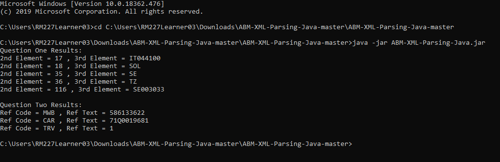

# ABM-XML-Parsing-Java
ABM Developer Technical Questions 1 &amp; 2 Using Java.

# Requirements
* Java (compiled using 13.0.1).
* Compiler if using earlier Java version.

# Deployment Instructions
* Download this repository as ZIP and extract the contents.
* Open Command Prompt and navigate to the ABM-XML-Parsing-Java-master\ABM-XML-Parsing-Java-master directory.
* Use the "java -jar ABM-XML-Parsing-Java.jar" command to run the program.

# Incompatible Java Version Instruction
* Import the project into your favourite IDE or compiler.
* Compile and export the program as a runnable JAR file.
* Complete above steps.

